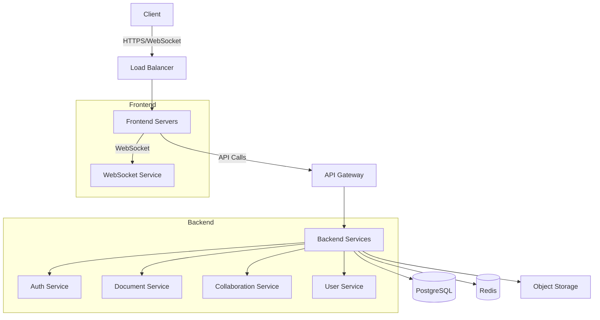
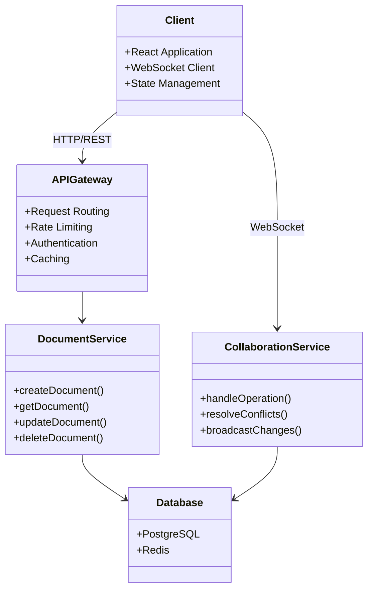
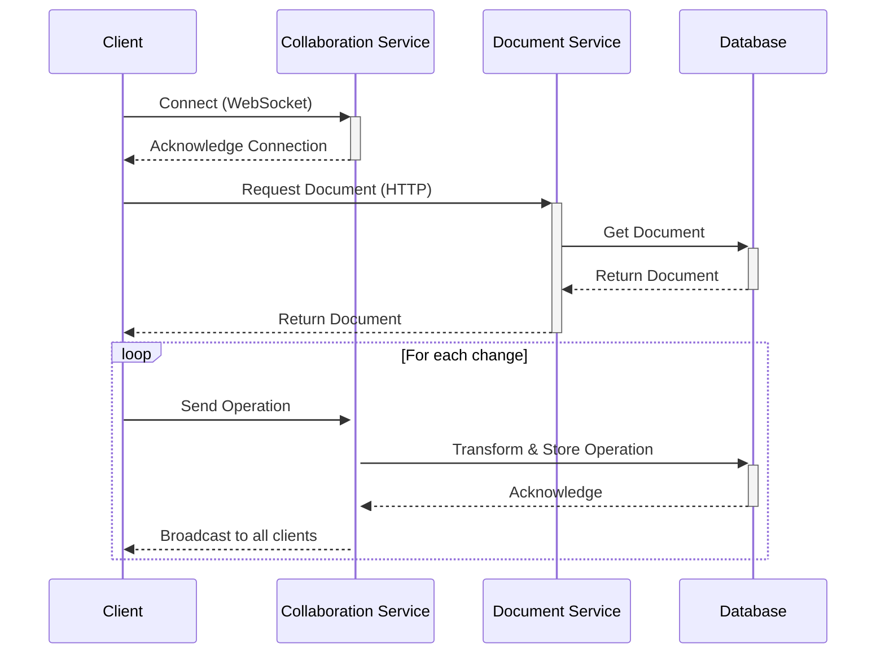
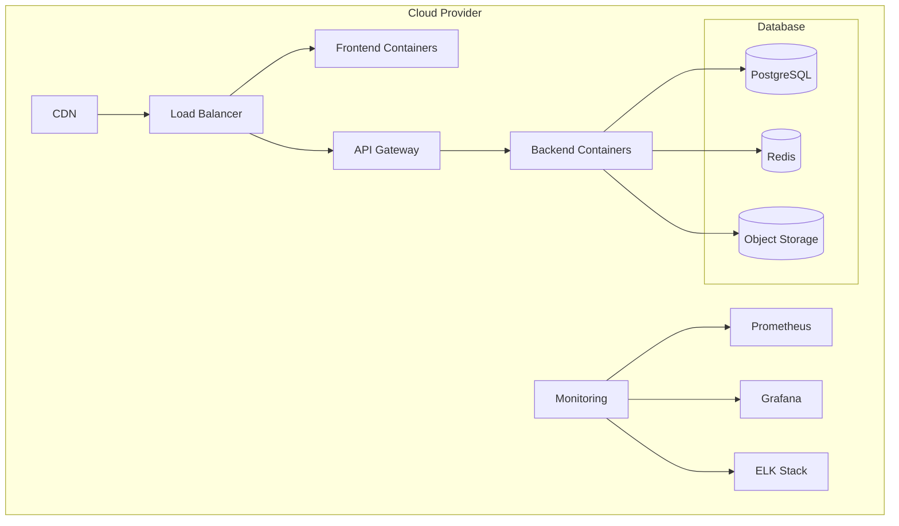
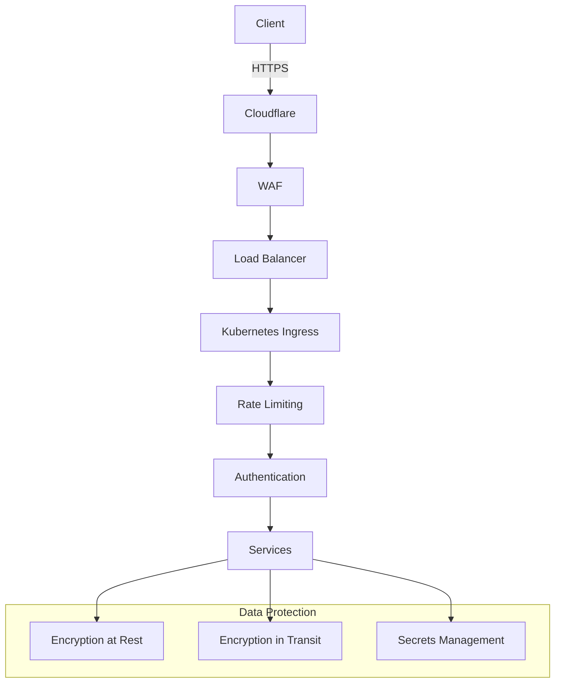

# System Architecture

## High-Level Overview

```mermaid
graph TD
    A[Client] -->|HTTPS/WebSocket| B[Load Balancer]
    B --> C[Frontend Servers]
    C -->|API Calls| D[API Gateway]
    D --> E[Backend Services]
    E --> F[(PostgreSQL)]
    E --> G[(Redis)]
    E --> H[Object Storage]
    
    subgraph Frontend
    C -->|WebSocket| I[WebSocket Service]
    end
    
    subgraph Backend
    E --> J[Auth Service]
    E --> K[Document Service]
    E --> L[Collaboration Service]
    E --> M[User Service]
    end
```

## Component Diagram

```mermaid
classDiagram
    class Client {
        +React Application
        +WebSocket Client
        +State Management
    }
    
    class APIGateway {
        +Request Routing
        +Rate Limiting
        +Authentication
        +Caching
    }
    
    class DocumentService {
        +createDocument()
        +getDocument()
        +updateDocument()
        +deleteDocument()
    }
    
    class CollaborationService {
        +handleOperation()
        +resolveConflicts()
        +broadcastChanges()
    }
    
    class Database {
        +PostgreSQL
        +Redis
    }
    
    Client --> APIGateway : HTTP/REST
    APIGateway --> DocumentService
    Client --> CollaborationService : WebSocket
    DocumentService --> Database
    CollaborationService --> Database
```

## Data Flow

### Document Editing Flow

```mermaid
sequenceDiagram
    participant C as Client
    participant CS as Collaboration Service
    participant DS as Document Service
    participant DB as Database
    
    C->>+CS: Connect (WebSocket)
    CS-->>-C: Acknowledge Connection
    
    C->>+DS: Request Document (HTTP)
    DS->>+DB: Get Document
    DB-->>-DS: Return Document
    DS-->>-C: Return Document
    
    loop For each change
        C->>+CS: Send Operation
        CS->>+DB: Transform & Store Operation
        DB-->>-CS: Acknowledge
        CS-->>C: Broadcast to all clients
    end
```

## Infrastructure

```mermaid
graph TD
    subgraph Cloud Provider
        A[CDN] --> B[Load Balancer]
        B --> C[Frontend Containers]
        B --> D[API Gateway]
        D --> E[Backend Containers]
        
        subgraph Database
            F[(PostgreSQL)]
            G[(Redis)]
            H[(Object Storage)]
        end
        
        E --> F
        E --> G
        E --> H
        
        I[Monitoring] --> J[Prometheus]
        I --> K[Grafana]
        I --> L[ELK Stack]
    end
```

## Security Architecture

```mermaid
graph TD
    A[Client] -->|HTTPS| B[Cloudflare]
    B --> C[WAF]
    C --> D[Load Balancer]
    D --> E[Kubernetes Ingress]
    E --> F[Rate Limiting]
    F --> G[Authentication]
    G --> H[Services]
    
    subgraph Data Protection
        I[Encryption at Rest]
        J[Encryption in Transit]
        K[Secrets Management]
    end
    
    H --> I
    H --> J
    H --> K
```
